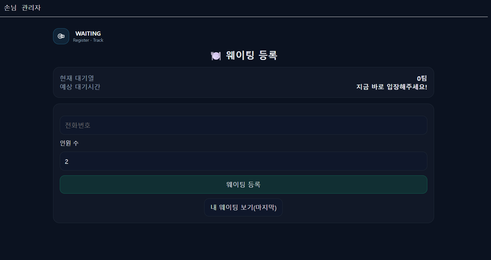
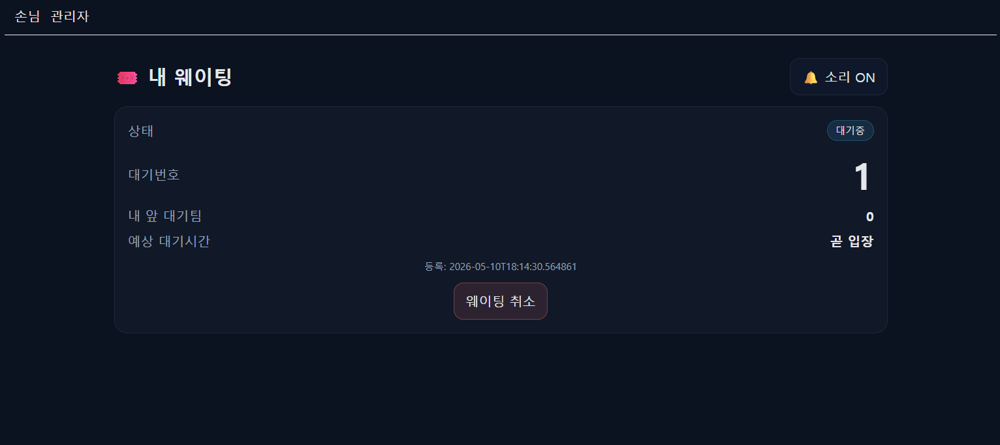
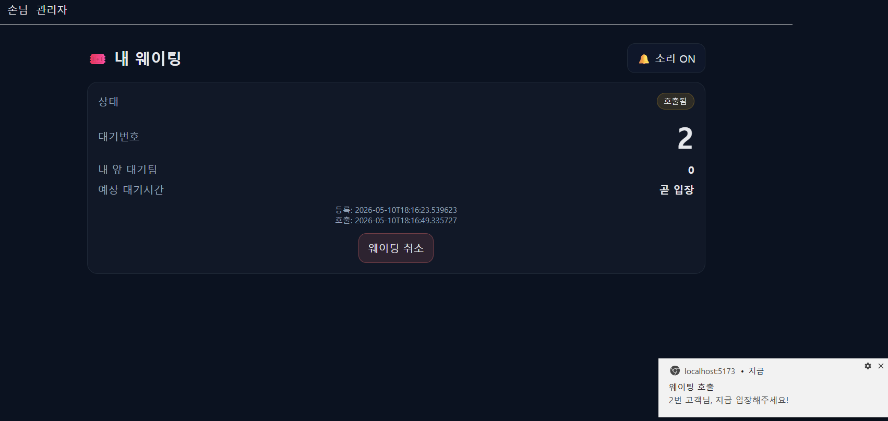
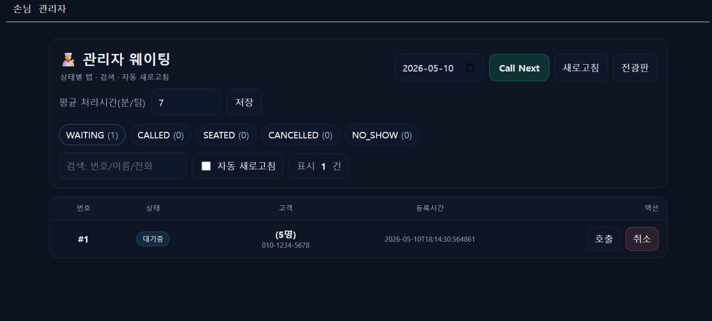
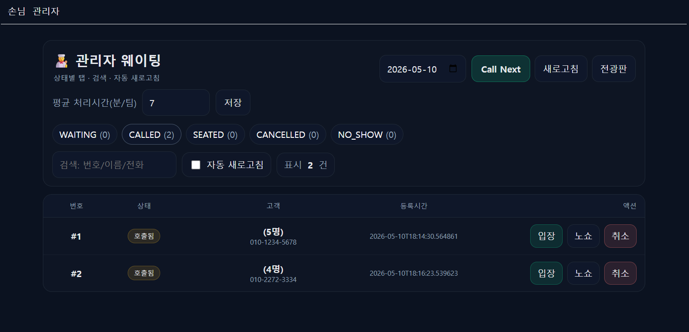
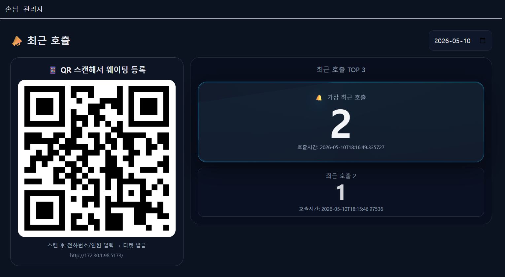

<div align="center">

# 🍽️ Waiting Service
### 식당 웨이팅 등록 및 관리자 호출 관리 서비스

<p>
  손님은 전화번호와 인원 수를 입력해 <b>웨이팅을 등록</b>하고,<br/>
  관리자는 <b>호출 · 입장 · 노쇼 · 취소</b> 처리를 할 수 있는<br/>
  <b>React + Spring Boot</b> 기반의 웨이팅 관리 서비스입니다.
</p>

<p>
  
  
  
  
  
  
  
  
  
</p>

</div>

---

## 📌 프로젝트 소개

**Waiting Service**는 식당이나 매장에서 사용할 수 있는 웨이팅 관리 서비스입니다.

손님은 전화번호와 인원 수를 입력해 웨이팅을 등록하고, 자신의 대기번호와 예상 대기시간을 확인할 수 있습니다.  
관리자는 관리자 대시보드에서 대기팀을 호출하거나 입장, 노쇼, 취소 상태로 변경할 수 있으며, 전광판 화면에서는 최근 호출 번호와 QR 등록 화면을 함께 보여줄 수 있습니다.

이 프로젝트는 **손님용 등록 페이지**, **내 웨이팅 티켓 페이지**, **관리자 대시보드**, **전광판 화면**으로 구성되어 있습니다.



---

## ✨ 주요 기능

### 1. 손님 웨이팅 등록

- 전화번호와 인원 수를 입력해 웨이팅 등록
- 등록 시 당일 기준 대기번호 자동 발급
- 등록 후 티켓 페이지로 이동
- 마지막으로 조회한 티켓 ID를 `localStorage`에 저장
- 같은 날짜에 동일 전화번호로 중복 등록 방지


---

### 2. 실시간 대기 현황 및 예상 대기시간 제공

- 메인 화면에서 현재 대기팀 수 표시
- `WAITING + CALLED` 팀 수를 기준으로 예상 대기시간 계산
- 기본 평균 처리시간 7분/팀 적용
- 관리자 설정값에 따라 날짜별 평균 처리시간 변경 가능
- 메인 화면은 3초마다 자동 갱신



---

### 3. 내 웨이팅 티켓 조회

- 대기번호, 상태, 내 앞 대기팀 수, 예상 대기시간 표시
- 상태값: `WAITING`, `CALLED`, `SEATED`, `CANCELLED`, `NO_SHOW`
- 앞에 1팀 남았을 때 토스트 알림 제공
- 호출 시 브라우저 알림 + 소리 알림 제공
- `WAITING`, `CALLED` 상태에서는 손님이 직접 취소 가능
- 티켓 화면은 3초마다 자동 갱신



---

### 4. 관리자 대시보드

- 날짜별 웨이팅 목록 조회
- 상태별 탭 제공
  - `WAITING`
  - `CALLED`
  - `SEATED`
  - `CANCELLED`
  - `NO_SHOW`
- 번호, 이름, 전화번호 검색 기능
- 자동 새로고침 on/off
- `Call Next` 버튼으로 가장 빠른 대기팀 호출
- 개별 항목에 대해 호출 / 입장 / 노쇼 / 취소 처리 가능
- 날짜별 평균 처리시간 저장 가능




---

### 5. 전광판 화면

- 최근 호출 TOP 3 표시
- 가장 최근 호출 번호 강조 표시
- QR 코드 스캔으로 손님 등록 화면 연결
- 2초마다 최근 호출 목록 자동 갱신



---

## 🧠 서비스 처리 흐름

```text
손님 웨이팅 등록
   ↓
React 프론트엔드
   ↓
Spring Boot API
   ├─ 중복 웨이팅 여부 확인
   ├─ 날짜별 대기번호 발급
   ├─ 웨이팅 정보 저장
   └─ 예상 대기시간 계산
   ↓
MariaDB 저장
   ↓
손님 티켓 화면 / 관리자 대시보드 / 전광판 화면 갱신
